<!-- SPDX-License-Identifier: MIT -->

# Nimbus

Nimbus is a Wayland desktop environment written in Rust, with every user interface built in [Slint](https://slint.dev).
It covers the same ground as GNOME and KDE Plasma: a compositor, a desktop shell, system services, a settings app, and core apps.

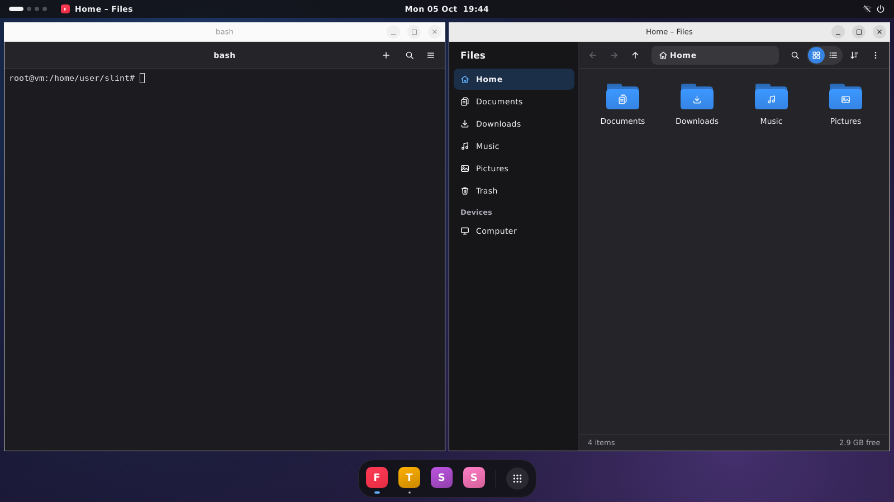

## Features

### Compositor (`nimbus-compositor`)

- Built on [Smithay](https://github.com/Smithay/smithay), with three backends:
  a nested window for development (winit), DRM/KMS with libinput and libseat on a TTY (udev), and headless rendering into memory for tests.
- Window management with workspaces, floating placement, a master-stack tiling layout, maximize, fullscreen, minimize,
  interactive move and resize, and focus by direction.
- Protocols: xdg-shell, xdg-decoration, wlr-layer-shell, xdg-activation, linux-dmabuf, presentation-time, viewporter,
  fractional-scale, single-pixel-buffer, cursor-shape, idle-notify, idle-inhibit, ext-session-lock, keyboard-shortcuts-inhibit,
  ext-foreign-toplevel-list, wlr-output-management, primary selection, and ext/wlr data control for clipboard tools.
- Display configuration through wlr-output-management, from Settings or tools such as `wlr-randr` and `kanshi`,
  remembered per display and applied again at startup and on hotplug.
- Keyboard shortcuts from the configuration, with live reload.
- A control socket that speaks JSON lines, used by the shell, `nimbusctl`, the Settings app, and scripts.
- No UI of its own: the shell is a separate client, so a crashed shell doesn't take windows down.
  A locked session stays locked, and black, until a lock client takes over again.
- Screenshots of any output, from a key binding or `nimbusctl screenshot`.
- X11 apps through [xwayland-satellite](https://github.com/Supreeeme/xwayland-satellite),
  which starts when the first X11 app connects and again after it exits.
- A built-in gradient backdrop when no wallpaper is set.

### Shell (`nimbus-shell`)

- A top panel with workspace dots, the focused app, a centered clock, and status icons.
- A dock with pinned and running apps, window indicators, and a context menu.
- A full-screen launcher with fuzzy search over installed desktop entries.
- An overview with workspace thumbnails and window cards you can drag between workspaces.
- Quick settings for volume, brightness, Wi-Fi, Bluetooth, do not disturb, dark style, media playback, and power.
- A notification server with toasts, actions, and a notification center next to the calendar.
- On-screen displays for volume and brightness keys, and a lock screen.
- A polkit authentication dialog on the focused output, with an identity picker when several admins may answer.
- The `nimbus-shell` binary runs the shell as a Wayland client, on layer-shell and session-lock surfaces.
  It hosts the system services and the polkit agent, checks lock screen passwords through PAM on a worker thread,
  and locks on logind requests and after inactivity.

### Services (`nimbus-services`)

- `org.freedesktop.Notifications`, UPower, NetworkManager, BlueZ, MPRIS, logind, PipeWire or PulseAudio volume, and backlight.
- The session's polkit authentication agent, which checks responses through polkit's setuid `polkit-agent-helper-1`, never in process.
- Each service degrades on its own: a missing daemon hides its feature and is picked up again when it appears.

### Portal (`nimbus-portal`)

- An `xdg-desktop-portal` Settings backend, so apps that follow the portal pick up the Nimbus color scheme and accent color, live.

### Apps

- **Settings** (`nimbus-settings`): appearance, panel and dock, workspaces, keyboard and mouse, shortcuts, power, notifications, about,
  and displays, which you arrange by dragging and set up with resolution, refresh rate, scale, and rotation.
- **Files** (`nimbus-files`): grid and list views, search, a freedesktop trash, thumbnails, and copy and move with conflict handling and undo.
- **Terminal** (`nimbus-terminal`): tabs, color schemes, search, true color, and box drawing, on `alacritty_terminal`.
- **System Monitor** (`nimbus-monitor`): processes with sorting, tree view, and signals; CPU, memory, network, and disk graphs; and file systems.

### Session (`nimbus-session`)

- `nimbus-session` starts the compositor and the shell, sets up D-Bus and the session environment, and runs autostart once per session.
  It restarts the shell whenever it exits, with a growing delay,
  and both after a compositor crash, locked if the screen was locked.
- `nimbusctl` controls a running session from the command line.

## Architecture

Nimbus is a Cargo workspace of small crates with one-way dependencies.
Domain crates have no UI, the shell is a view over them, and the shell process wires them together.
The compositor knows only Wayland and the control socket.
Every UI imports the `@nimbus/theme.slint` design system, so the shell and the apps look like one product.
See [docs/architecture.md](docs/architecture.md) for the crates, the threading model, and the protocols between them.

## Building

Install Rust 1.88 or newer and the development packages for Wayland, xkbcommon, libinput, libseat, GBM, DRM, EGL, udev, D-Bus, fontconfig, and PAM.
On Debian and Ubuntu:

```sh
sudo apt install libwayland-dev libxkbcommon-dev libinput-dev libseat-dev libgbm-dev libdrm-dev \
  libegl-dev libudev-dev libdbus-1-dev libfontconfig-dev libpam0g-dev
```

Then build from the repository root:

```sh
cargo build --manifest-path desktop/Cargo.toml --workspace --release
```

## Running

### Nested, Inside Another Desktop

Build the workspace, then run a session in a window of your current Wayland or X11 session.
`nimbus-session` finds the compositor and the shell next to itself:

```sh
cargo build --manifest-path desktop/Cargo.toml --workspace
target/debug/nimbus-session --backend winit --no-autostart
```

Apps started from the launcher or with `nimbusctl spawn` open inside the nested session.

### On a TTY or From a Display Manager

Install Nimbus, then log in on a TTY and run `nimbus-session`, or pick "Nimbus" in your display manager:

```sh
desktop/data/install.sh --prefix /usr/local
```

The script builds every binary, installs the session file, desktop entries, the systemd user target, the portal backend and its configuration,
an example configuration, and the lock screen's PAM service in `/etc/pam.d/nimbus`.
Run it with `--uninstall` to remove everything again, and with `--help` for the other options.

### Headless

The headless backend renders into memory, which is useful for tests and screenshots:

```sh
NIMBUS_HEADLESS_OUTPUTS=1600x900 nimbus-compositor --backend headless
```

Apps need Slint's software renderer there, since there's no GPU: start them with `SLINT_BACKEND=winit-software`.

### The Compositor and Shell by Hand

Start the compositor, then start `nimbus-shell` with the variables the compositor prints:

```sh
nimbus-compositor --backend winit
# NIMBUS_READY WAYLAND_DISPLAY=wayland-1 NIMBUS_SOCKET=/run/user/1000/nimbus-wayland-1.sock
WAYLAND_DISPLAY=wayland-1 NIMBUS_SOCKET=/run/user/1000/nimbus-wayland-1.sock nimbus-shell
```

The shell renders with OpenGL on a GPU and in software otherwise.
Set `NIMBUS_SHELL_RENDERER=software` or `NIMBUS_SHELL_RENDERER=gl` to choose.

## Controlling the Desktop

`nimbusctl` talks to the compositor named by `$NIMBUS_SOCKET`, which the compositor sets for every app it starts.
Workspaces are numbered from 1, as in the panel.

```sh
nimbusctl state                 # windows, workspaces, and outputs
nimbusctl state --json          # the same as JSON
nimbusctl watch                 # one JSON line per event
nimbusctl spawn nimbus-files    # run a command in the session
nimbusctl workspace 2
nimbusctl move 7 3              # move window 7 to workspace 3
nimbusctl layout tiling
nimbusctl launcher              # toggle the launcher
nimbusctl overview              # toggle the overview
nimbusctl screenshot ~/shot.png
nimbusctl lock
nimbusctl quit
```

Run `nimbusctl --help` for every command.

## Configuration

Nimbus reads `$XDG_CONFIG_HOME/nimbus/config.toml` and applies changes as soon as the file is saved.
The Settings app edits the same file.
The compositor saves display settings under `[[outputs]]` whenever a display configuration is applied.
[data/config.toml](data/config.toml) lists every option with its default and a comment.

Default shortcuts:

| Keys | Action |
| --- | --- |
| Super+Space | Launcher |
| Super+Tab | Overview |
| Super+Return | Terminal |
| Super+E | Files |
| Super+Q | Close the window |
| Super+Up, Super+F, Super+H | Maximize, fullscreen, minimize |
| Super+T | Switch between floating and tiling |
| Super+1 to 9, Super+Shift+1 to 9 | Switch to, or move the window to, a workspace |
| Super+L | Lock the screen |
| Print | Screenshot |
| Super+Shift+E | Log out |

## Screenshots

These come from the headless compositor running the real shell and apps, and from each crate's screenshot tests.

| | |
| --- | --- |
| 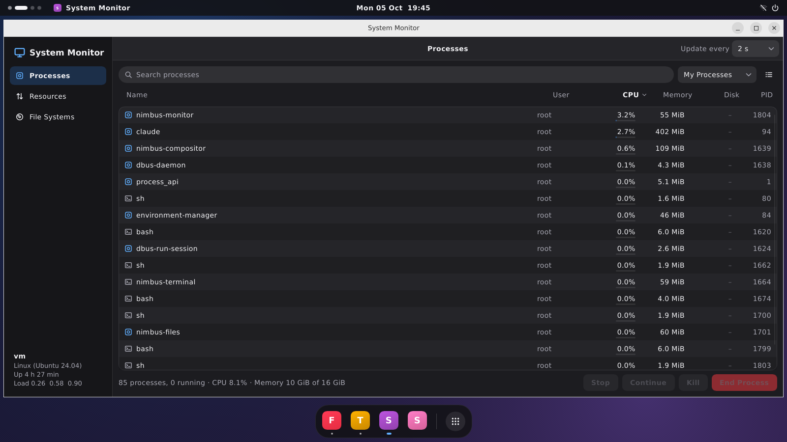 | 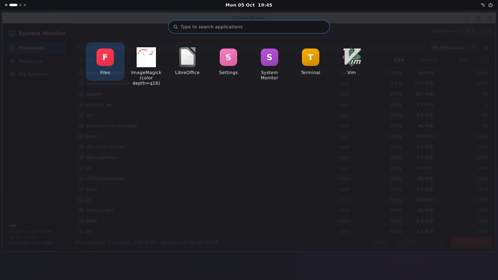 |
| 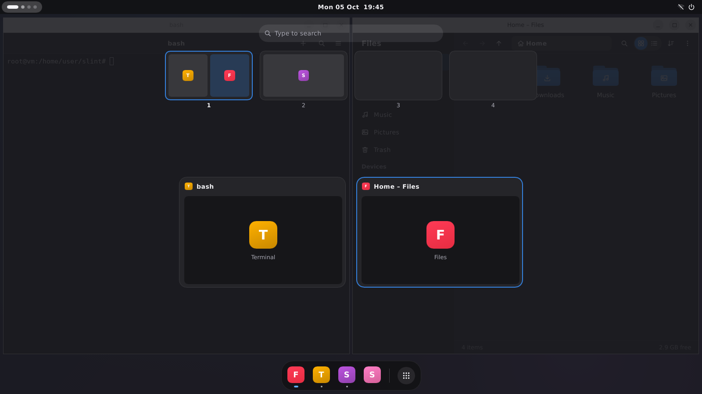 | 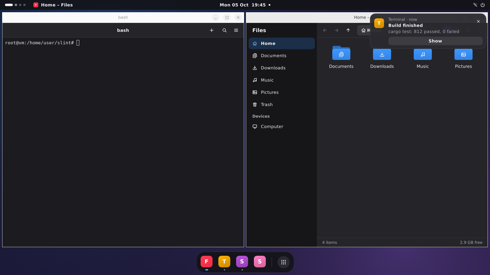 |
| 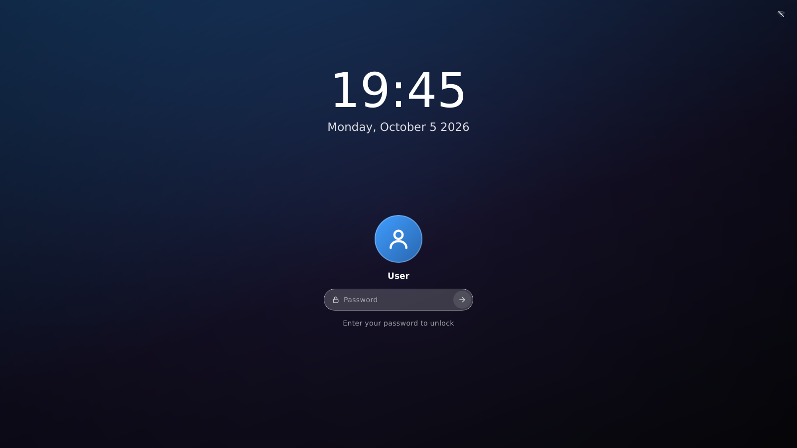 | 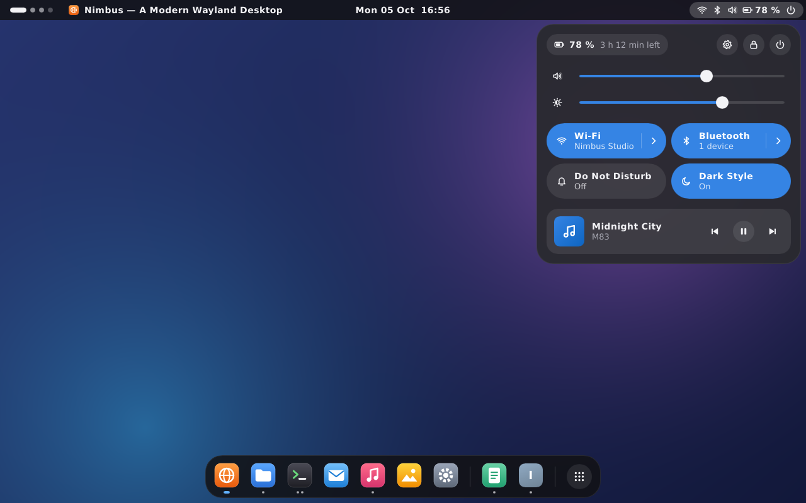 |
| 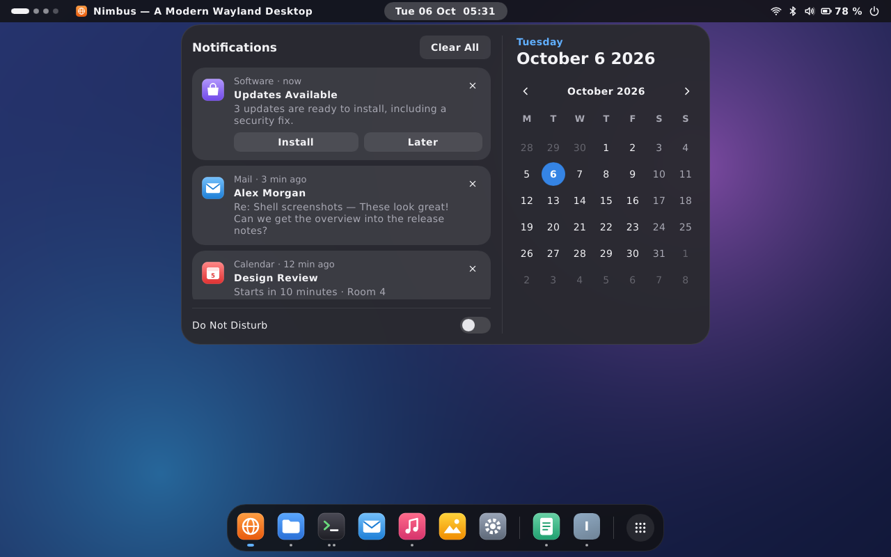 | 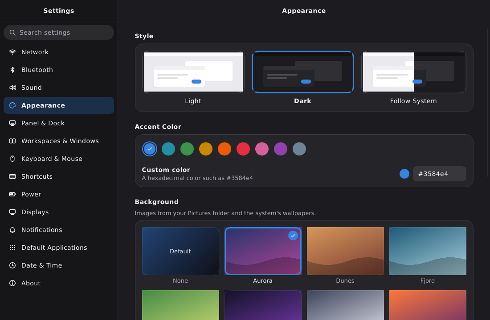 |
| 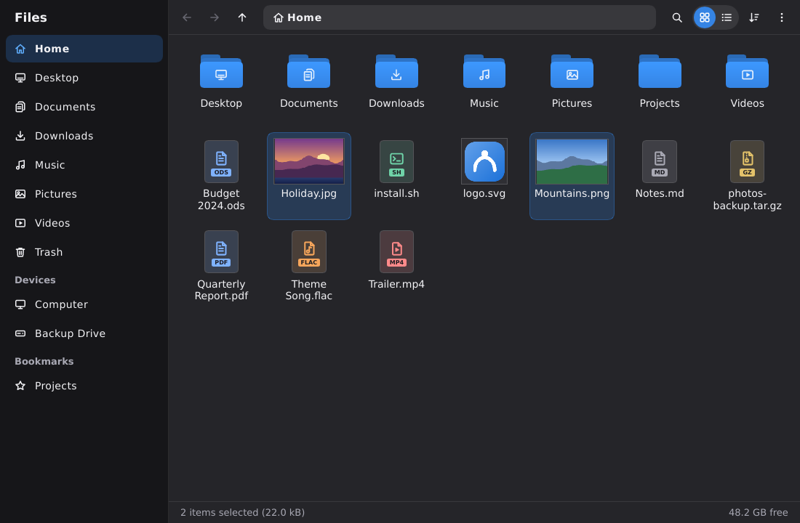 |  |
| 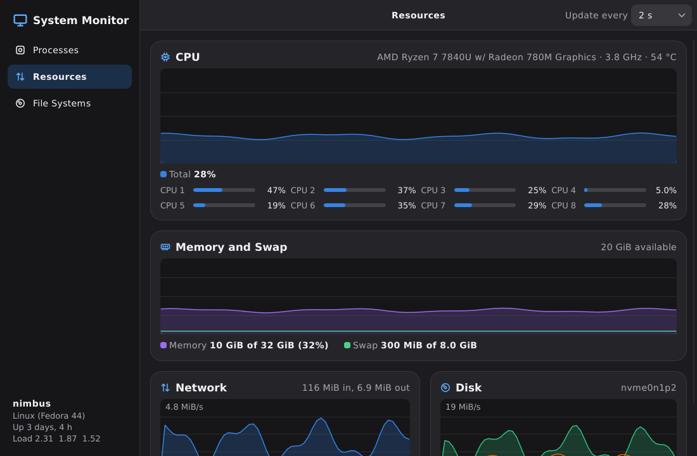 | 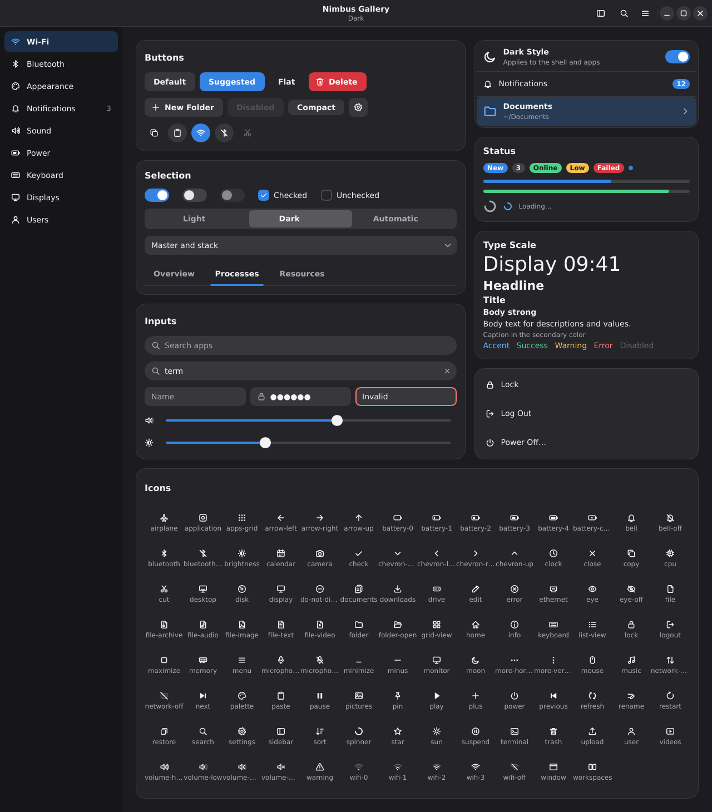 |

More are in [docs/screenshots](docs/screenshots).
Regenerate the test screenshots with `NIMBUS_UPDATE_SCREENSHOTS=1 cargo test --manifest-path desktop/Cargo.toml --workspace`.

## Testing

```sh
cargo test --manifest-path desktop/Cargo.toml --workspace
cargo clippy --manifest-path desktop/Cargo.toml --workspace --all-targets -- -D warnings
```

The tests need no display.
The compositor tests start the real binary headless and drive it with a Wayland test client and the control socket.
The shell tests run the `nimbus-shell` binary against the headless compositor and check its screenshots.
The session tests supervise shell scripts that stand in for the compositor and the shell.
The services tests start a private `dbus-daemon` with fake system daemons, and skip themselves when it's missing.

## Status and Known Limitations

Nimbus is young.
The headless backend and the shell run end to end in tests, but the udev and winit backends haven't been run on real hardware yet.

- The shell process hasn't run on the winit or udev backends yet.
  It doesn't take touch input, and it draws the default cursor everywhere.
- The shell's OpenGL renderer has only run on Mesa's llvmpipe, against the headless compositor.
  It's untested on GPUs, and it redraws whole surfaces for each frame.
- Typing on the shell's lock screen and unlocking have no end-to-end test.
  The headless compositor feeds synthetic clicks and keys, but PAM needs a real account.
- The shell's popups and its overlay with the launcher and overview don't animate when they close, since their surfaces go right away.
- Toasts and the OSD show above fullscreen windows.
- A click on an empty spot of the panel doesn't close an open popup; a click on a window or the dock does.
- The shell has no input method support; it handles dead keys and Compose sequences with the locale's XKB compose table.
  A key that completes or cancels a sequence still sends its own key release.
- X11 apps need xwayland-satellite 0.6 or later; without it, `DISPLAY` stays unset.
  XWayland has only run against a script standing in for xwayland-satellite.
  Changing `[xwayland]` takes effect when the compositor restarts.
- Nimbus draws no server-side decorations; apps draw their own title bars, which don't follow the Nimbus theme.
- Display configuration has only run headless.
  On udev, a test checks modes and free CRTCs but not the kernel's bandwidth limits; an apply that hits them rolls back.
- Display settings are stored per display, not as profiles for each set of connected displays.
  Custom modes, adaptive sync, and output power management aren't supported.
- Any client may configure displays through wlr-output-management, as in other wlroots-style compositors.
- Touch, tablet, and pointer-constraint protocols aren't implemented.
- Screen blanking after inactivity and suspend on lid close aren't implemented yet; locking after inactivity is.
- Overview cards show app icons, not live window thumbnails.
- When an `ext-session-lock` client dies, the session stays locked and black until another client locks it.
  The shell locks again right away, or once `nimbus-session` restarts it after a crash.
- The compositor checks a lock surface's size only on commits that attach a buffer.
- The lock marker is per `XDG_RUNTIME_DIR`, so a nested compositor or session in the same runtime directory can create or remove the real session's marker.
- If `nimbus-session` is killed with SIGKILL, autostarted apps keep running.
  An app that moves itself to a new process group or session isn't stopped at logout either.
- Saving the configuration replaces `config.toml` with a new file.
  A symlinked `config.toml` becomes a regular file, and an editor that saves in place doesn't take the configuration lock.
- `xdg-desktop-portal-wlr` screen casting needs wlr-screencopy, which Nimbus doesn't offer yet.
- The portal backend answers only `org.freedesktop.appearance`.
  It reports no contrast preference, since the configuration has no high contrast option.
  Older `xdg-desktop-portal` releases look for backends only in their own data directory, usually `/usr/share`;
  install with `--prefix /usr` for them to find `nimbus.portal`.
- The polkit agent has only run against a fake polkitd and a script standing in for `polkit-agent-helper-1`.
  It registers only inside a logind session, so a nested session leaves polkit to the host desktop's agent.
  It doesn't use polkit's socket-activated helper, which distributions that drop the helper's setuid bit need.
- polkit requests wait while the session is locked, and their dialog shows once it unlocks.
- The UI is English only.
- Each crate's README lists its own gaps.
