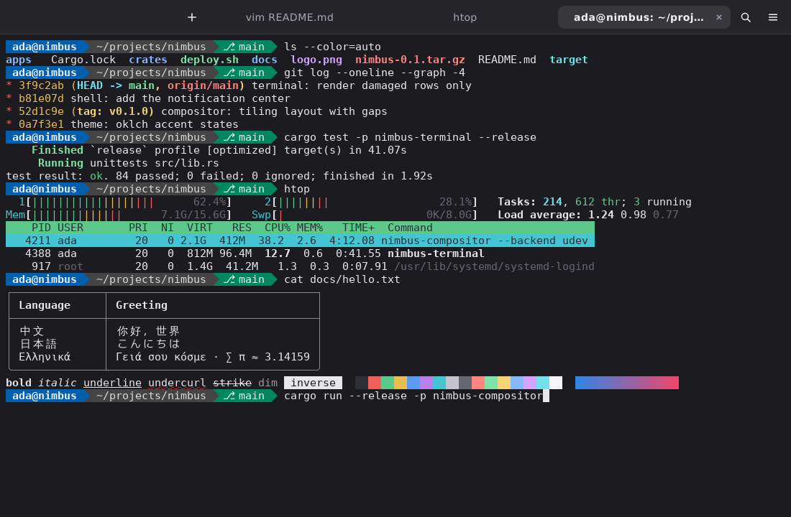

<!-- SPDX-License-Identifier: MIT -->

# Nimbus Terminal

The Nimbus terminal emulator, `org.nimbus.Terminal`.



## Features

- Tabs in the header bar, titled by the running program, with a confirmation before closing a busy tab or window.
- xterm-compatible input: modified cursor and function keys, application cursor mode, bracketed paste, and SGR mouse reports.
- Selection by dragging, double-clicking a word, or triple-clicking a line; Ctrl selects a block, Shift extends.
  Selected text goes to the primary selection, and the middle button pastes it.
- Search in the scrollback with Ctrl+Shift+F, with every match on screen highlighted.
- Color schemes: Nimbus, which follows the desktop's light or dark style, plus Nimbus Dark and Light, Solarized, Dracula, Gruvbox, and Nord.
- Bold, italic, dim, inverse, strikeout, and five underline styles; 16, 256, and 24-bit color; CJK and emoji.
- Pixel-exact box drawing, block elements, and Powerline separators.
- Zoom with Ctrl+Plus, Ctrl+Minus, and Ctrl+0, or Ctrl and the wheel.

## Usage

```text
nimbus-terminal [--working-directory DIR] [--title TITLE] [-e COMMAND [ARGS...]]
```

Preferences live in `$XDG_CONFIG_HOME/nimbus/terminal.toml`, and the window follows the Nimbus appearance settings live.

## Design

- `alacritty_terminal` parses output, keeps the grid and scrollback, and runs each PTY on its own thread.
- The app draws the grid itself into an image that Slint shows:
  `fonts` finds the monospace font and its fallbacks with `fontdb`, `glyphs` rasterizes them with `swash`,
  and `render` redraws only the rows that changed, using the terminal's damage tracking.
- Font discovery, process inspection, the clipboard, and saving preferences run on worker threads,
  which report to the UI thread through one channel.
- The modules besides `app` and `screenshot` have no UI dependency and carry the unit tests.

## Testing

`cargo test -p nimbus-terminal` runs the unit tests, a behavior test on Slint's testing backend,
and renders the window with sample content on the software renderer.
Set `NIMBUS_UPDATE_SCREENSHOTS=1` to write `docs/screenshots/terminal-*.png`,
or run `nimbus-terminal --screenshot PATH` for a single image.
