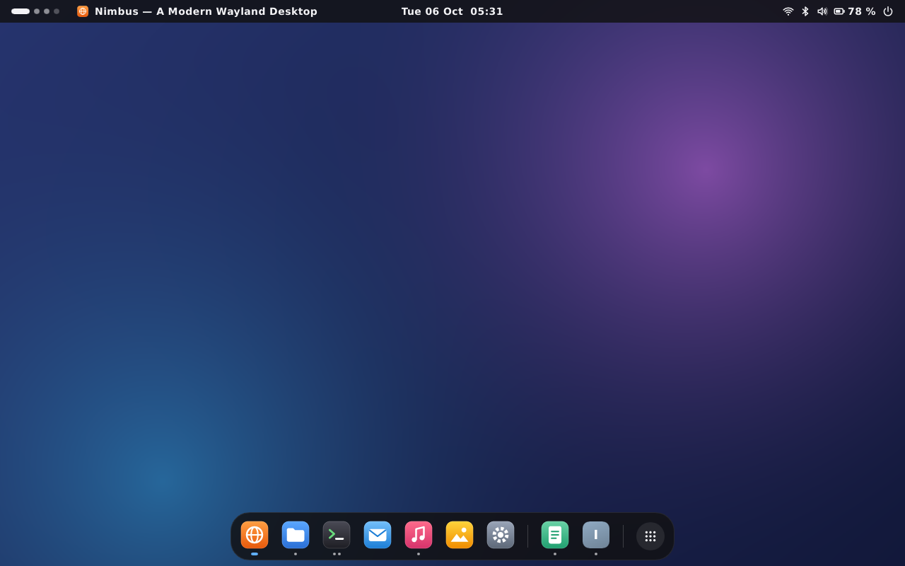
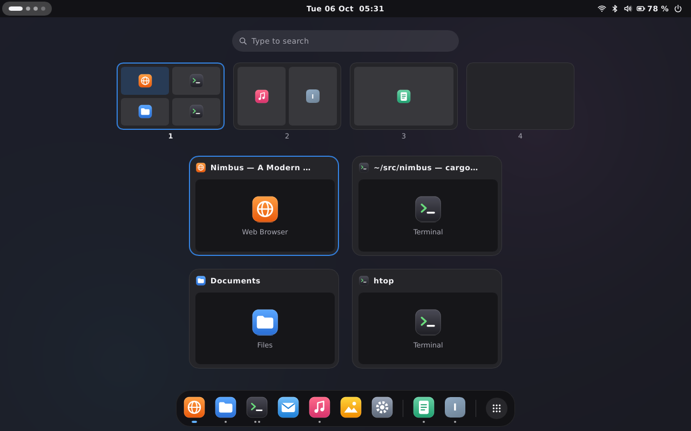
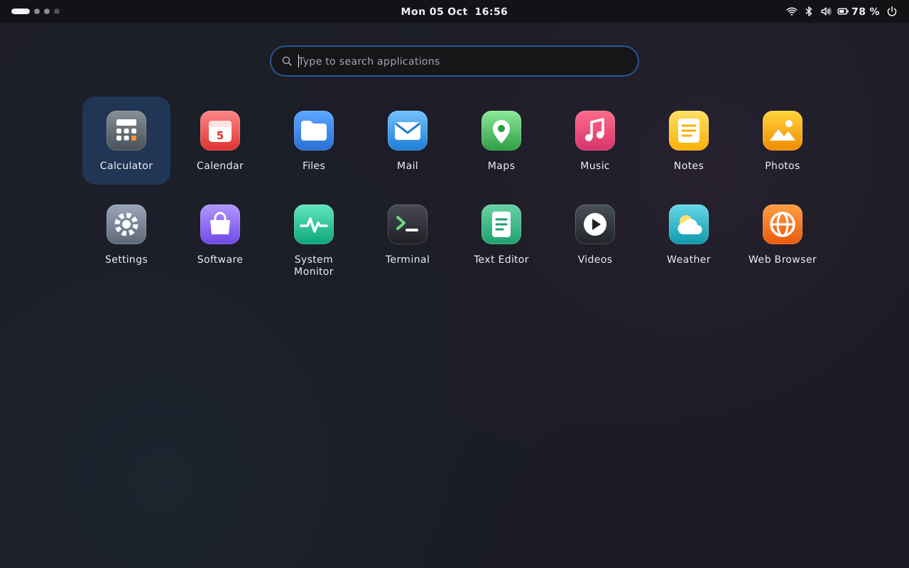
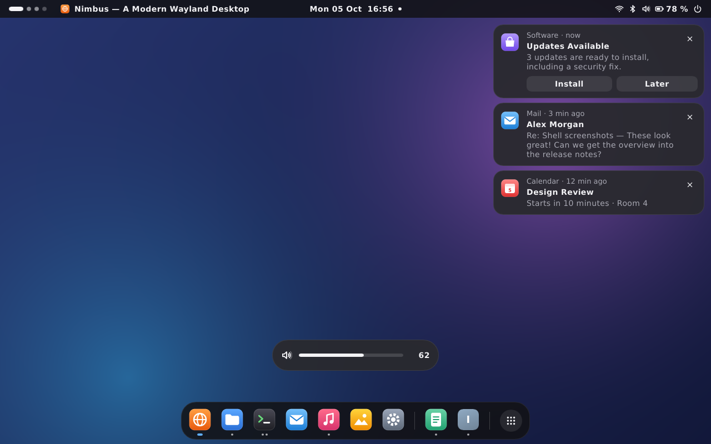
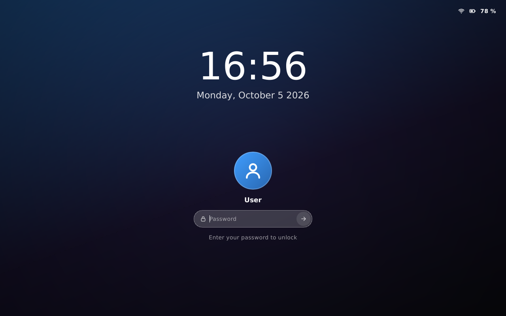

<!-- SPDX-License-Identifier: MIT -->

# nimbus-shell

The Nimbus desktop shell: top panel, dock, launcher, overview, quick settings, calendar and notification center,
toasts, on-screen display, and lock screen.
It's one shared model shown by a transparent Slint window per output, built on the `@nimbus/theme.slint` design system.



| Overview | Launcher |
| --- | --- |
|  |  |
| **Quick settings** | **Calendar and notifications** |
|  |  |
| **Toasts and OSD** | **Lock screen** |
|  |  |

## Hosting the Shell

The host creates one `ShellModel` after setting the Slint platform, then:

- Feeds it data: `set_config`, `set_compositor_state` and `handle_compositor_event`,
  `set_apps`, `handle_service_event`, and `show_osd` for hardware keys.
- Handles each `ShellAction` it emits: compositor requests, service commands, launches, and opening Settings.
- Calls `set_config_path` when it runs with `--config`, because the dark style toggle and dock pins save there.

For each output, it creates a `ShellView` with `ShellView::new(&model, output)`, then:

- Calls `toggle_launcher` and `toggle_overview` for the Super key bindings.
- Routes pointer input inside `input_region()` to the view, and keyboard input while `wants_keyboard()` is true.
  Query the region after rendering, since new toasts count from the frame that draws them.
- Keeps maximized and tiled windows out of `exclusive_zone()`.

Views share everything else, so a toast closed on one output closes on all of them.

## Locking

`ShellModel::set_locked(true)` closes everything open in the views.
While locked, the host shows a `LockView` on each output, a window apart from the output's `ShellView`,
and drops it after unlocking.

The lock screen doesn't check passwords itself.
Register a handler with `ShellModel::on_unlock_attempt`; it receives the typed password while every lock screen shows a spinner.
Answer with `set_locked(false)` on success or `unlock_failed()` on failure, for example after a PAM conversation.

```rust
model.on_unlock_attempt(move |password| auth.submit(password));
// Once the check finishes:
if ok { model.set_locked(false) } else { model.unlock_failed() }
```

## Preview and Tests

`cargo run -p nimbus-shell --features preview --bin nimbus-shell-preview` runs the shell in a 1280x800 window
with a mock session that reacts to clicks, and logs every action.
Locking opens the lock screen in a second window, which accepts any password except `wrong`.

`cargo test -p nimbus-shell` runs unit tests, behavior tests on Slint's testing backend,
and renders every state with the software renderer.
Set `NIMBUS_UPDATE_SCREENSHOTS=1` to write `docs/screenshots/shell-*.png`.
